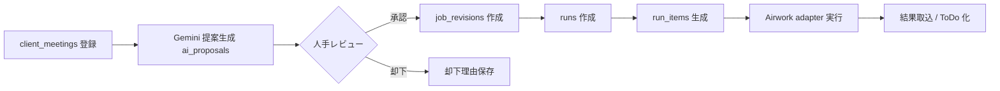

# 基本設計書（Ver.2.1）
Airワーク一括入稿（Excel/TSV）× AI改善提案 × 更新運用自動化システム

---

## 0. ドキュメント情報
- 文書名：基本設計書（Ver.2.1）
- 対象：求人媒体更新代行業務のうち **Airワーク採用管理の「求人一括入稿」機能**を用いた更新運用
- 前提：
  - デプロイ：Vercel
  - リポジトリ：GitHub（PR運用）
  - DB：Neon（Postgres）
  - ファイル：Vercel Blob（生成ファイル・結果ファイル・証跡）
  - AI：Gemini Flash（サーバー側呼び出しのみ）
- 更新日：2026-03-15
- 版：2.1
- 本版の位置づけ：
  - 既存 Ver.2 を、現行実装との差分を踏まえた「実装可能仕様」に更新
  - 中核3機能（会議起点AI提案 / 14日freshness / runベース外部反映）を主軸に再構成

---

## 1. システム目的 / スコープ

### 1.1 目的
本システムは、求人更新運用を「人手で媒体画面を都度編集する方式」から、以下の安全な運用ループへ移行することを目的とする。

1. 会議登録 → AI提案 → 人手承認 → 版確定（job_revision）→ run生成
2. 14日freshness検知 → 更新候補化 → 必要に応じてAI提案 / ToDo化
3. Airwork反映を run / run_items 単位で分離し、実行証跡を監査可能に管理

### 1.2 スコープ（In Scope）
- CRM（顧客 / チャネルアカウント / 会議メモ）
- 求人正本管理（jobs / job_postings / job_revisions）
- AI提案生成（Geminiサーバー呼び出し）
- 承認ワークフロー（差分レビュー、採用、却下、部分採用）
- Run生成 / 管理（ファイル生成、対象追跡、結果反映）
- freshness検知と運用ToDo化

### 1.3 非スコープ（Out of Scope）
- Airwork管理画面のRPAやブラウザ自動操作
- Airwork以外媒体への本格展開
- AI提案の自動即時反映（人間承認なし）
- デザインテーマの再設計

---

## 2. 三つの中核業務能力（Core Capabilities）

### 2.1 会議登録 → AI提案 → 承認 → 版作成 / run作成
- `client_meetings` に会議入力
- 会議内容と現行求人を元に `ai_proposals` を生成
- 人手レビューで採用可否を判断
- 承認時は必ず `job_revisions` を新規作成
- 外部反映は直接更新せず、必ず `runs` / `run_items` 経由

### 2.2 14日freshness検知 → 更新候補化
- 日次Cronで掲載鮮度を判定
- `job_postings.is_refresh_candidate` を判定根拠として利用
- 対象を「提案生成候補」または「手動ToDo」に振り分け
- 自動実行ではなく、監査可能な運用キューとして扱う

### 2.3 Airwork反映（runベース実行）
- 承認済み版を run として束ねる
- 生成ファイルを Blob に保存し、実行単位で追跡
- 実行は adapter 層（将来 worker）経由で安全に実施
- 資格情報は抽象参照（credential_ref相当）を前提に扱い、平文パスワード保管を設計上禁止

---

## 3. 役割定義（Actors）
- **Admin**：設定管理、承認ルール変更、監査閲覧
- **Operator**：会議登録、AI提案確認、承認申請、run実行
- **Reviewer**：提案承認 / 却下、差分確認
- **ReadOnly**：閲覧専用
- **System (Cron/Worker)**：freshness検知、run実行補助、監査記録

---

## 4. 高レベルアーキテクチャ

### 4.1 論理構成
- UI: Next.js App Router
- API: Route Handlers（薄い層）
- Domain/Data: `src/lib/**`（DB・検証・AI・Blob）
- DB: Neon Postgres（server-only接続）
- File: Vercel Blob
- AI: Gemini Flash（server-only）
- Batch: Vercel Cron +（将来）publish worker

### 4.2 外部依存境界
- Neon、Blob、Gemini はサーバーでのみ呼び出し
- クライアントバンドルには秘密情報を出さない
- 外部公開処理は adapter インターフェース越しに実行

---

## 5. 現状実装（Observed）と目標設計（Target）

### 5.1 現状実装（2026-03時点）
- `/api/cron/freshness` はスタブ応答のみ（`{ ok: true }`）
- ダッシュボード指標に `job_postings.is_refresh_candidate` 件数表示は存在
- `ai_proposals` / `client_meetings` / `job_revisions` のテーブル・参照は存在するが、会議→提案→承認の一連APIは未接続
- `runs` / `run_items` は一覧・詳細の参照中心で、生成・実行・結果反映の統合フローが未完
- `channel_accounts` は `login_id` / `memo` / `login_secret_encrypted` 前提の器があるが、資格情報抽象化＋安全実行アダプタは未実装

### 5.2 目標設計
- 会議登録をトリガにAI提案を生成し、承認時に revision を作成
- 承認済み revision から run を生成し、run_items 単位で publish を追跡
- freshness Cron が候補抽出・ToDo化・（任意）提案生成キュー投入まで行う
- Airwork反映は adapter 経由、資格情報は参照ID（credential_ref）で間接管理

### 5.3 主要ギャップ
1. API不足：meeting/proposal/approve/run-execute の主要経路が未整備
2. 状態遷移不足：proposal/revision/run の状態整合が未強制
3. 自動化不足：freshness Cron が実処理未実装
4. 実行安全性不足：publish adapter と idempotency の定義不足

---

## 6. 非機能要件
- **可用性**：Vercelデプロイ前提、障害時は run 再実行可能
- **監査性**：承認・生成・実行・失敗を `audit_logs` へ記録
- **保守性**：DBアクセスは server-only + parameterized SQL
- **安全性**：秘密情報非露出、入力はZod検証、失敗時は明示的エラー
- **拡張性**：Airwork adapter を境界に、将来媒体追加余地を確保

---

## 7. セキュリティ / 承認ポリシー
- AIは提案のみ。公開中データを直接上書きしない
- 承認済み `job_revisions` が存在しない publish は禁止
- 外部反映は常に `runs` / `run_items` を経由
- 認証情報は `channel_accounts` の暗号化情報または `credential_ref` を使い、平文資格情報を保持しない
- APIは `{ ok: true|false }` 形式で統一し、内部スタックトレースは返却しない

---

## 8. 運用ポリシー
- 日次運用：freshnessスキャン→対象確認→ToDo割当
- 変更運用：会議登録→AI提案→人手承認→run作成→実行→結果取り込み
- 失敗運用：run失敗時は run_items 粒度で原因特定し再実行
- 監査運用：承認者・実行者・時刻・対象求人を必ず記録

---

## 9. 推奨実装順序（Build Order）
1. 会議→AI提案→承認→revision 作成 API を先に接続
2. 承認済み revision から manual publish run 作成を実装
3. run 実行 adapter と idempotency key を導入
4. freshness Cron を候補抽出 + ToDo化まで実装
5. freshness から proposal queue 連携を追加

---

## 10. Mermaid（全体業務フロー）

---

## 11. DB Alignment Addendum（Actual Neon Schema Priority）

### 11.1 採用ルール
実装時の永続化名は、論理名より Neon 実スキーマを優先する。

### 11.2 主要カノニカル名
- org_id
- owner_name
- login_secret_encrypted
- memo
- value_constraints
- name_ja
- internal_title
- file_format
- file_sha256
- actor_user_id
- client_meetings（meetings ではない）

### 11.3 参照先
- `Docs/db/neon-live-schema-snapshot.json`
- `Docs/db/schema-diff-report.md`
- `Docs/db/db-alignment-policy.md`
