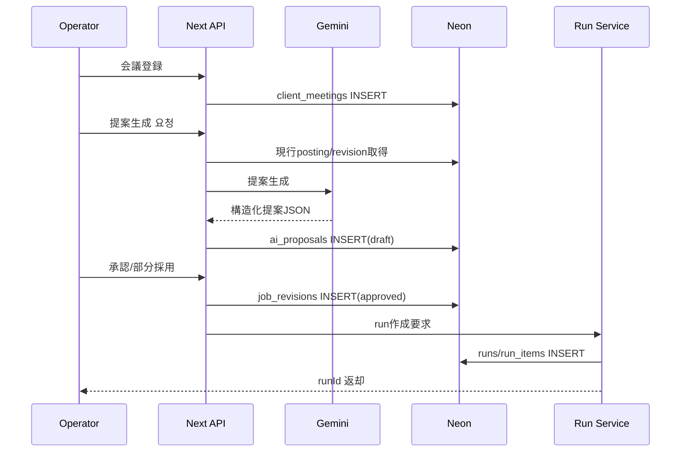
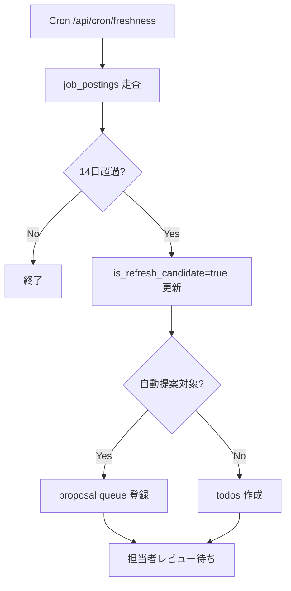

# 詳細設計書（Ver.2.1）
Airワーク一括入稿（Excel/TSV）× AI改善提案 × 更新運用自動化システム

---

## 0. ドキュメント情報
- 文書名：詳細設計書（Ver.2.1）
- 更新日：2026-03-15
- 版：2.1
- 前提：
  - デプロイ：Vercel
  - リポジトリ：GitHub（PR運用）
  - DB：Neon（Postgres）
  - ファイル：Vercel Blob
  - AI：Gemini Flash（サーバー側のみ）
  - Runtime：DB/Blob/AIは `nodejs`

---

## 1. 実装観測サマリ（Observed）

### 1.1 実装済みの器
- スキーマ上に `ai_proposals` / `job_revisions` / `runs` / `run_items` / `channel_accounts` / `client_meetings` が存在
- ダッシュボード向けメトリクスとして `job_postings.is_refresh_candidate` 集計が実装済み
- Run関連は一覧・詳細の read API が存在

### 1.2 現在の未接続/不足
- `/api/cron/freshness` はスタブ（本処理なし）
- 会議登録→提案生成→承認→revision確定の連結APIが不足
- run実行（生成→外部反映→結果更新）の write フロー不足
- `channel_accounts` は資格情報カラム前提があるが、安全なpublish実行抽象（credential_ref + adapter）が未実装

---

## 2. ターゲット設計（Target）

### 2.1 コア方針
1. AIは提案のみで、公開データを直接上書きしない
2. 承認時は必ず `job_revisions` を作成
3. 外部公開は常に `runs` / `run_items` 経由
4. 資格情報は `credential_ref` 等の参照で扱い、平文パスワード保存を禁止

### 2.2 典型ユースケース
- 会議後に proposal を生成し、採用分から revision を作成
- approved revision を run に積んで publish する
- freshness 対象を日次で抽出し、proposalキュー or ToDo を作成

---

## 3. データモデル（ER/変更方針）

### 3.1 既存主テーブル責務（Table-by-table）
- `clients`: 顧客基本情報
- `channel_accounts`: Airwork接続情報、運用メモ、資格情報参照
- `client_meetings`: 会議メモ・会議起点情報
- `jobs`: 求人の論理親（顧客紐付け）
- `job_postings`: 媒体公開単位、`is_refresh_candidate` を保持
- `job_revisions`: 提案採用後の版データ（承認対象）
- `ai_proposals`: AI生成提案（要約・差分・リスク）
- `runs`: 公開実行のバッチ単位
- `run_items`: postingごとの実行対象と結果
- `todos`: 手動作業キュー
- `audit_logs`: 監査証跡

### 3.2 追加/拡張推奨（最小）
- `channel_accounts`
  - 追加候補: `credential_ref text null`（外部シークレット参照）
  - 既存 `login_secret_encrypted` は後方互換で残す
- `ai_proposals`
  - 追加候補: `status text`（draft/in_review/approved/rejected/applied）
  - 追加候補: `approved_revision_id uuid null`
- `runs`
  - 追加候補: `idempotency_key text`
  - 追加候補: `execution_error jsonb`
- `run_items`
  - 追加候補: `result_status text` / `error_detail jsonb` / `retry_count int`
- `job_postings`
  - 追加候補: `freshness_detected_at timestamptz`
  - 追加候補: `next_refresh_due_at timestamptz`

### 3.3 関係性（要点）
- `client_meetings.client_id -> clients.id`
- `ai_proposals.meeting_id -> client_meetings.id`
- `ai_proposals.job_posting_id -> job_postings.id`
- `job_revisions.job_posting_id -> job_postings.id`
- `runs -> run_items(1:N)`
- `run_items.job_posting_id -> job_postings.id`

---

## 4. 状態遷移定義（State Machine）

### 4.1 ai_proposals
- `draft`（生成直後）
- `in_review`（レビュー開始）
- `approved`（採用決定）
- `rejected`（不採用）
- `applied`（revision化済み）

**遷移ルール**
- `approved -> applied` は `job_revisions` 生成成功時のみ
- `rejected` 後は再利用せず、新規proposalを生成

### 4.2 job_revisions
- `draft`
- `in_review`
- `approved`
- `rejected`
- `applied`

**遷移ルール**
- publish対象にできるのは `approved` のみ
- publish成功時に `applied` へ遷移

### 4.3 runs
- `draft`
- `file_generated`
- `queued`
- `executing`
- `done`
- `failed`
- `partially_failed`

**遷移ルール**
- `draft -> file_generated` は生成ファイルのBlob保存完了が条件
- `executing -> done/failed/partially_failed` は `run_items` 集約結果で決定

### 4.4 job_postings
- `active`
- `archived`
- `paused`

補助フラグ:
- `is_refresh_candidate: boolean`
- `publish_status_cache: text`（媒体状態の参照キャッシュ）

---

## 5. API設計（実装向け）

### 5.1 会議 / AI提案
- `POST /api/meetings`
  - input: clientId, note, meetingAt
  - output: `{ ok: true, meetingId }`
- `POST /api/job-postings/:id/ai-proposals`
  - input: meetingId, promptOptions
  - output: `{ ok: true, proposalId }`
- `POST /api/ai-proposals/:id/review`
  - input: action(approve|reject|partial), comment
  - output: `{ ok: true, proposalStatus }`
- `POST /api/ai-proposals/:id/apply`
  - input: adoptionPayload
  - output: `{ ok: true, revisionId }`

### 5.2 revision / run
- `POST /api/job-revisions/:id/approve`
  - output: `{ ok: true, revisionStatus: "approved" }`
- `POST /api/runs`
  - input: runType, postingIds[]
  - output: `{ ok: true, runId }`
- `POST /api/runs/:id/generate-file`
  - output: `{ ok: true, blobPath, sha256 }`
- `POST /api/runs/:id/execute`
  - output: `{ ok: true, status }`
- `POST /api/runs/:id/import-result`
  - output: `{ ok: true, updatedItems }`

### 5.3 freshness / todo
- `GET /api/cron/freshness`
  - cron専用
  - output: `{ ok: true, detected, todoCreated, proposalQueued }`
- `POST /api/todos`
  - output: `{ ok: true, todoId }`

### 5.4 共通ポリシー
- 入力はZodで検証
- 応答は `{ ok: true|false }`
- SQLは parameterized のみ
- DB接続処理は `runtime = "nodejs"`

---

## 6. シーケンス設計（Mermaid）

### 6.1 Meeting → Proposal → Approval → Publish


### 6.2 Freshness Cron → Proposal/ToDo/Queue


### 6.3 Airwork Adapter Execution Flow
```mermaid
flowchart LR
  A[run execute API] --> B[idempotency key 検証]
  B --> C[channel account 取得]
  C --> D[credential_ref 解決]
  D --> E[adapter.prepare(run_items)]
  E --> F[adapter.publish(file/records)]
  F --> G[result normalize]
  G --> H[run_items 更新]
  H --> I[runs 集約更新 done/failed]
  I --> J[audit_logs 記録]
```

---

## 7. Cron / Batch フロー

### 7.1 freshness（日次）
1. 対象抽出（`last_published_at` 起点）
2. `is_refresh_candidate` / `freshness_detected_at` 更新
3. 提案対象はキューへ、手動対象は ToDo 作成
4. 実行結果を `audit_logs` 記録

### 7.2 publish worker（将来）
1. `runs.status=queued` を取得
2. channel/account/credential 解決
3. adapter実行
4. `run_items` 更新
5. run終端状態更新

---

## 8. Publish Worker / Adapter 設計
- `PublishAdapter` インターフェース
  - `prepare(context)`
  - `publish(payload)`
  - `normalize(result)`
- Airwork実装はこのadapterを実装
- 認証情報は adapter 内でのみ復号 / 解決
- route handler から資格情報を返却しない

---

## 9. Gemini プロンプト責務分離
- **System Prompt**: 媒体制約、禁止事項、出力JSONスキーマ
- **Context Prompt**: 会議メモ、現行求人、制約条件
- **Validation Layer**: Zodで出力検証、失敗時は保存せずエラー返却
- **Human Review Layer**: summary/diff/risk/questions をUI提示し、承認を必須化

---

## 10. 監査ログ / 冪等性

### 10.1 監査対象
- proposal生成
- proposal承認/却下
- revision承認
- run生成/実行/完了/失敗
- freshness検知実行

### 10.2 冪等性ルール
- run execute に `idempotency_key` を必須化
- 同一keyで多重実行時は前回結果を返す
- cronは `yyyymmdd + org_id` 単位で重複実行防止

---

## 11. 推奨ビルド順（Gap解消順）
1. 会議/提案/承認 API（Phase 1）
2. revision→run生成と手動実行（Phase 1）
3. run execute adapter + idempotency（Phase 2）
4. freshness Cron本体 + ToDo作成（Phase 3）
5. freshness→proposal queue 自動化（Phase 3）

---

## 12. DB Alignment Addendum（Actual Neon Schema Priority）
- 実装は論理名より Neon 実名を優先
- canonical: `org_id`, `owner_name`, `login_secret_encrypted`, `memo`, `value_constraints`, `name_ja`, `internal_title`, `file_format`, `file_sha256`, `actor_user_id`
- meeting関連テーブルは `client_meetings` を正とする
- 参照先:
  - `Docs/db/neon-live-schema-snapshot.json`
  - `Docs/db/schema-diff-report.md`
  - `Docs/db/db-alignment-policy.md`
